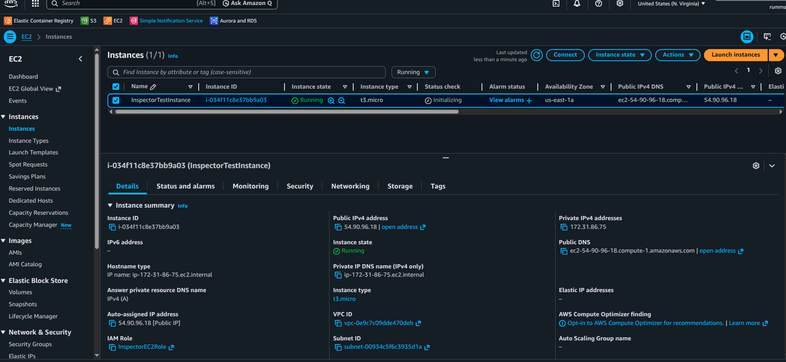
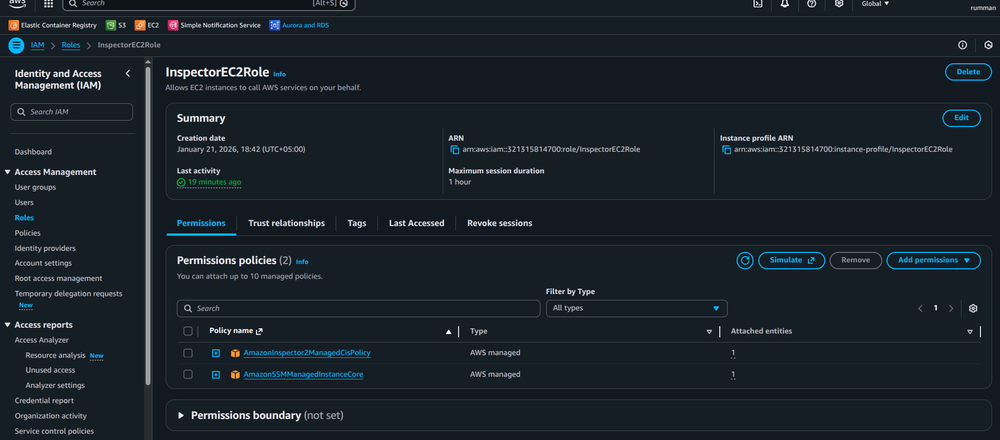
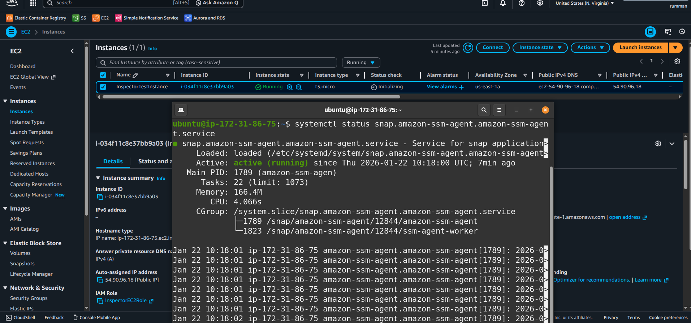
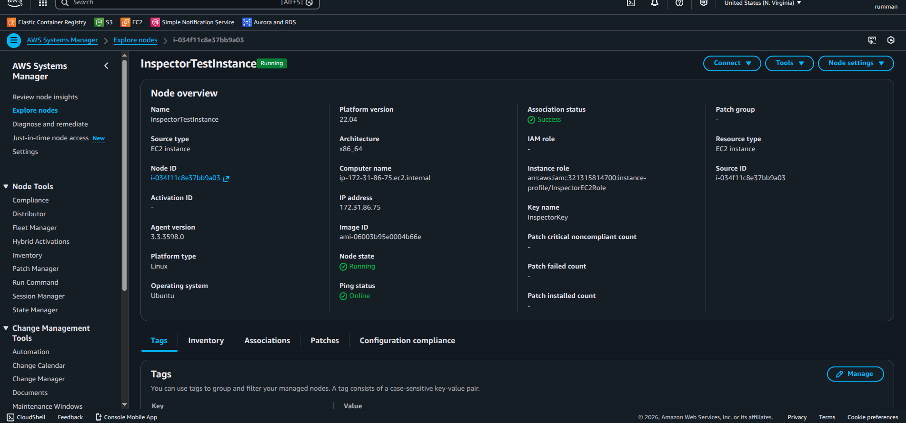
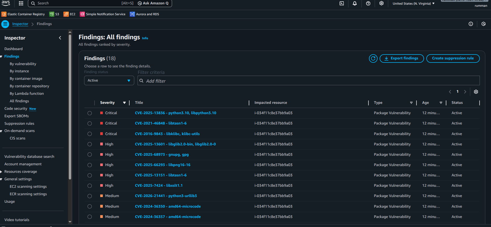
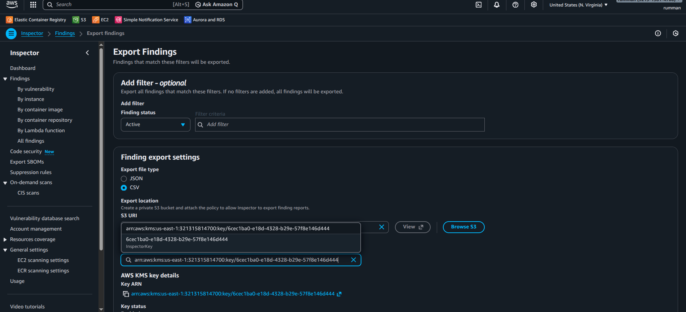
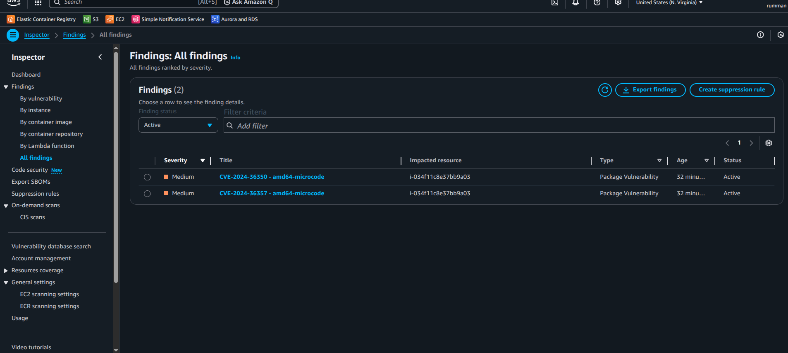

# AWS Amazon Inspector – EC2 Vulnerability Scanning & Remediation Lab

## Overview
This project demonstrates hands-on use of Amazon Inspector to:
- Automatically scan an EC2 instance for software vulnerabilities
- Review CVE findings and severity levels
- Apply remediation through package updates
- Verify risk reduction with a follow-up scan

It simulates a real-world cloud vulnerability management workflow suitable for entry-level SOC or cloud security roles.

## Environment
- **Cloud Provider**: AWS (Free Tier)
- **Service**: Amazon EC2 + Amazon Inspector
- **Operating System**: Ubuntu 22.04 LTS
- **Instance Type**: t2.micro
- **Access**: SSH (temporary) + AWS Systems Manager (SSM)
- **Region**: N. Virginia (us-east-1)

## Key Steps
1. Activated Amazon Inspector at account level
2. Launched a test EC2 instance with proper IAM role
3. Verified SSM agent and instance registration
4. Waited for initial scan (auto-triggered)
5. Analyzed findings (18 vulnerabilities initially)
6. Remediated via `sudo apt update && sudo apt upgrade -y`
7. Validated reduced findings (18 → 2) after re-scan
8. Exported reports (CSV) and cleaned up resources

## Evidence
- **Environment setup**: ec2-launch-details.png, ec2-iam-role-attached.png
- **SSM verification**: ssm-agent-status-running.png, ssm-instance-registered-fleet-manager.png
- **Initial findings**: inspector-initial-findings-dashboard.png, inspector-export-findings-to-s3.png, initial-vulnerabilities-report.csv
- **Remediation & results**: remediation-steps-terminal.png, post-remediation-findings-report.csv

## Evidence Preview

### Environment Setup

### SSM Configuration

### Initial Vulnerability Findings

### Remediation

## Learnings
- Amazon Inspector automates vulnerability discovery and prioritizes exploitable CVEs.
- Regular patching significantly reduces security risk.
- Proper IAM and SSM setup is critical for Inspector to function.
- Always clean up resources to stay within Free Tier limits.

## Ethical Disclaimer
This lab was conducted in an isolated educational environment. All resources were terminated after completion to avoid any costs.

## Status
Completed – Ready for portfolio use.

Open to entry-level remote SOC / cloud security opportunities.
